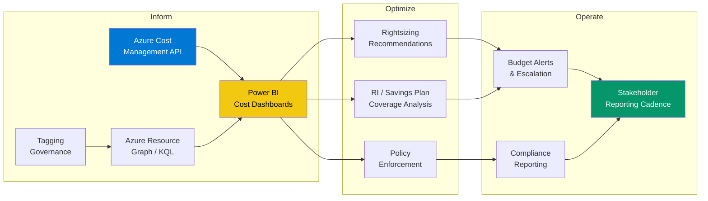
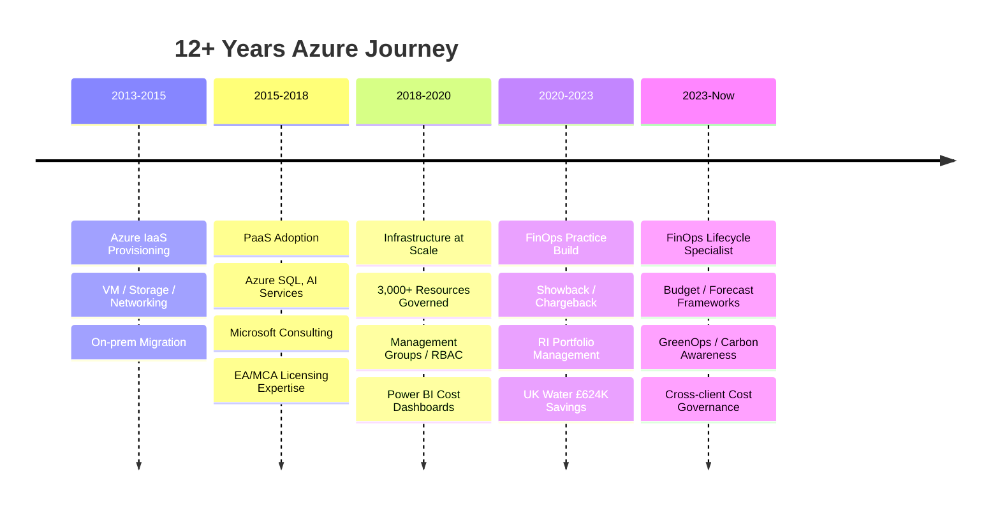

# Azure FinOps Skill Map

> Production-grade patterns, queries, and automation from **12+ years of Azure infrastructure and cost governance** work across European enterprises.

---

## Architecture

---

## Skill Domains

### 🔍 KQL — Azure Resource Graph Queries
Production queries for cost visibility, governance compliance, and optimization hunting.

| Area | File | Purpose |
|------|------|---------|
| Cost Analysis | [`kql/cost-analysis/`](kql/cost-analysis/) | Daily burn rate, cost by tag, subscription trends, spend anomalies |
| Governance | [`kql/governance-compliance/`](kql/governance-compliance/) | Tag compliance audit, policy compliance, RBAC drift detection |
| Optimization | [`kql/optimization/`](kql/optimization/) | Idle resources, rightsizing candidates, RI coverage gaps |
| Security | [`kql/security/`](kql/security/) | Cost-related security posture — unencrypted expensive resources, public IPs without NSGs |

### ⚡ PowerShell — Azure Automation
Scripts for governance enforcement, cost management, and bulk operations.

| Area | File | Purpose |
|------|------|---------|
| Cost Management | [`powershell/cost-management/`](powershell/cost-management/) | Export cost data, budget alerting, RI recommendations |
| Governance | [`powershell/governance/`](powershell/governance/) | Tag compliance enforcement, policy remediation, RBAC auditing |
| Automation | [`powershell/automation/`](powershell/automation/) | Scheduled runbooks, cost reporting pipelines, cleanup jobs |

### 🏗️ Bicep & ARM — Infrastructure as Code
Policy definitions, governance templates, and resource deployment patterns.

| Area | File | Purpose |
|------|------|---------|
| Policies | [`bicep/policies/`](bicep/policies/) | FinOps policy definitions — allowed SKUs, mandatory tags, cost centre enforcement |
| Governance | [`bicep/governance/`](bicep/governance/) | Management group hierarchy, RBAC custom roles, policy set definitions |
| ARM | [`arm/templates/`](arm/templates/) | Classic ARM patterns for Policy, Budgets, Exports |

### 📊 Power BI — Cost Analytics
Semantic models, DAX measures, and dashboard patterns for Azure cost reporting.

| Area | File | Purpose |
|------|------|---------|
| DAX Measures | [`powerbi/dax-measures/`](powerbi/dax-measures/) | MoM change, projected annual spend, RI coverage %, budget variance |
| Dataset Schema | [`powerbi/dataset-schema/`](powerbi/dataset-schema/) | Fact/dimension table design, relationship model, Cost API ingestion schema |

### 💰 Cost Governance Frameworks
Enterprise FinOps patterns — showback, chargeback, tagging taxonomies, RBAC models.

| Area | File | Purpose |
|------|------|---------|
| Showback/Chargeback | [`cost-governance/showback-chargeback/`](cost-governance/showback-chargeback/) | Allocation models, shared cost distribution, cost centre mapping |
| Budgeting & Forecasting | [`cost-governance/budgeting-forecasting/`](cost-governance/budgeting-forecasting/) | Budget methodology, forecast models, alert escalation matrices |
| Tagging Taxonomy | [`cost-governance/tagging-taxonomy/`](cost-governance/tagging-taxonomy/) | Enterprise tag dictionary, enforcement policy, compliance reporting |
| RBAC Models | [`cost-governance/rbac-models/`](cost-governance/rbac-models/) | Custom role definitions, scope hierarchy, least-privilege patterns |

### 🌱 GreenOps — Carbon Optimization
Azure region carbon awareness, sustainability reporting patterns.

| Area | File | Purpose |
|------|------|---------|
| GreenOps | [`greenops/`](greenops/) | Carbon-aware region selection, carbon intensity data, ESG reporting queries |

### 📦 Reserved Instances & Savings Plans
Commitment optimization strategies, coverage analysis, and ROI calculations.

| Area | File | Purpose |
|------|------|---------|
| RI Strategy | [`reserved-instances/`](reserved-instances/) | Coverage calculator, RI vs Savings Plan decision framework, breakeven analysis |

### 🗄️ Azure SQL
Database cost optimization, elastic pool right-sizing, and migration patterns.

| Area | File | Purpose |
|------|------|---------|
| Azure SQL | [`azure-sql/`](azure-sql/) | Elastic pool optimization, DTU/vCore right-sizing, geo-replication cost patterns |

### 🔄 DevOps Pipelines
CI/CD patterns for cost governance automation.

| Area | File | Purpose |
|------|------|---------|
| Pipelines | [`devops-pipelines/`](devops-pipelines/) | Policy deployment pipelines, cost reporting automation, infrastructure scanning |

---

## The Builder-to-Optimizer Arc

---

## Context

These patterns are derived from production Azure environments across multiple international clients:

- **European Insurance** — Multi-subscription cost governance, showback/chargeback, Power BI analytics across 3,000+ resources
- **UK Water Utility** — Architecture redesign delivering £52K/month (£624K annualised) savings
- **Microsoft India** — Azure commercial constructs (EA/MCA/CSP), customer cloud adoption, cost advisory
- **Government of India** — Power BI dashboards, data migration, Azure AI services

All client-specific data has been replaced with generic/sample values. No proprietary information is included.

---

## License

MIT — Use these patterns freely. Attribution appreciated but not required.

---

> **Duvvur Sai Krishna** · [Resume](https://duvvurs.github.io) · [GitHub](https://github.com/duvvurs) · [LinkedIn](https://linkedin.com/in/)
