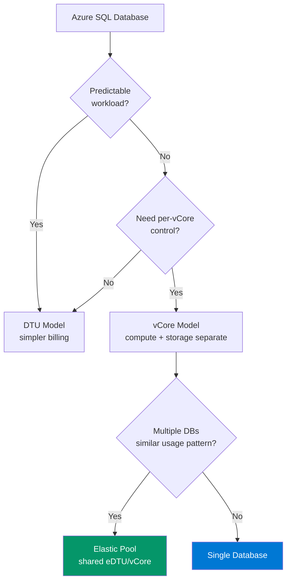

# Azure SQL — Cost Optimization Patterns

> Database tier optimisation from 5+ years of Azure SQL PaaS administration — single databases, elastic pools, and managed instances.

## Pricing Model Selection



## Elastic Pool Right-Sizing

### Identify Pool Candidates

```kql
// Find databases with complementary usage patterns
// Databases that peak at different times → pool them
Resources
| where type =~ 'microsoft.sql/servers/databases'
| extend 
    SKU = tostring(sku.name),
    Tier = tostring(sku.tier),
    MaxSizeMB = toint(properties.maxSizeBytes) / 1024 / 1024
| where name != 'master' and name != 'model'
| project name, SKU, Tier, MaxSizeMB, subscriptionId
| order by Tier desc
```

### Pool eDTU Utilisation Analysis

```powershell
#Requires -Module Az.Sql
<#
.SYNOPSIS
    Analyzes elastic pool utilisation to recommend right-sizing
.DESCRIPTION
    Production pattern from European insurance client — identified
    30% of elastic pools were over-provisioned by 2+ tiers.
#>

param([string]$ResourceGroupName, [string]$ServerName)

$Pools = Get-AzSqlElasticPool -ResourceGroupName $ResourceGroupName -ServerName $ServerName

foreach ($Pool in $Pools) {
    $Metrics = Get-AzMetric -ResourceId $Pool.ResourceId -MetricName "dtu_consumption_percent" -TimeGrain 01:00:00 -StartTime (Get-Date).AddDays(-30)
    
    $AvgDTU = ($Metrics.Data | Measure-Object -Property Average -Average).Average
    $MaxDTU = ($Metrics.Data | Measure-Object -Property Maximum -Maximum).Maximum
    $PctAbove80 = ($Metrics.Data | Where-Object { $_.Maximum -gt 80 }).Count / $Metrics.Data.Count * 100
    
    $Recommendation = if ($AvgDTU -lt 20 -and $MaxDTU -lt 60) {
        "⬇️ DOWNSIZE: Avg $([math]::Round($AvgDTU,1))% — drop 1-2 tiers"
    } elseif ($MaxDTU -gt 90) {
        "⬆️ UPSIZE: Peak $([math]::Round($MaxDTU,1))% — increase 1 tier"
    } else {
        "✅ OPTIMAL: Avg $([math]::Round($AvgDTU,1))%, Peak $([math]::Round($MaxDTU,1))%"
    }
    
    [PSCustomObject]@{
        PoolName      = $Pool.ElasticPoolName
        CurrentDTU    = $Pool.Dtu
        AvgUtilisation = "$([math]::Round($AvgDTU,1))%"
        PeakUtilisation = "$([math]::Round($MaxDTU,1))%"
        PctTimeAbove80 = "$([math]::Round($PctAbove80,1))%"
        Recommendation = $Recommendation
    }
} | Format-Table -AutoSize
```

## Geo-Replication Cost Patterns

| Configuration | Primary Cost | Secondary Cost | When to Use |
|---------------|-------------|---------------|-------------|
| **Active Geo-Rep** | Compute + Storage | Compute + Storage (same tier) | DR with read-scale |
| **Failover Group** | Compute + Storage | Compute + Storage (same tier) | Auto-failover DR |
| **Zone-Redundant** | 1.25× compute | Included | HA within region |
| **Backup LRS → ZRS** | Included | +storage cost | Compliance backup |

## Auto-Scale Script Pattern

```powershell
#Requires -Module Az.Sql
<#
.SYNOPSIS
    Scale Azure SQL database up/down on schedule
.DESCRIPTION
    Production pattern: scale down non-prod databases outside business hours
    Savings: ~60% for databases that only need business-hours capacity
#>

param(
    [string]$ResourceGroupName,
    [string]$ServerName,
    [string]$DatabaseName,
    [ValidateSet('S0', 'S1', 'S2', 'S3', 'S4', 'S6', 'S7', 'S9', 'S12', 'P1', 'P2', 'P4', 'P6', 'P11', 'P15')]
    [string]$TargetTier,
    [ValidateSet('ScaleUp', 'ScaleDown')]
    [string]$Direction
)

$DB = Get-AzSqlDatabase -ResourceGroupName $ResourceGroupName -ServerName $ServerName -DatabaseName $DatabaseName

Write-Host "Current: $($DB.Edition) / $($DB.CurrentServiceObjectiveName)" -ForegroundColor Cyan

if ($Direction -eq 'ScaleUp') {
    Write-Host "Scaling UP to $TargetTier" -ForegroundColor Green
} else {
    Write-Host "Scaling DOWN to $TargetTier" -ForegroundColor Yellow
}

$DB | Set-AzSqlDatabase -RequestedServiceObjectiveName $TargetTier

Write-Host "✓ Scaled to $TargetTier" -ForegroundColor Green
```

## Migration Cost Estimation

| Source | Target | Method | Cost Impact |
|--------|--------|--------|-------------|
| On-prem SQL Server | Azure SQL Managed Instance | Native backup/restore | Similar TCO, less ops |
| On-prem SQL Server | Azure SQL Database | DMA assessment + migration | 30-50% lower TCO |
| Azure SQL Single DB | Elastic Pool | Move to pool | 20-40% savings for multi-DB |
| Azure SQL DTU → vCore | vCore model | Migration wizard | More control, potential savings |
| Premium → Standard + ZRS | Zone-redundant backup | Configuration change | ~50% savings if HA is via app layer |
