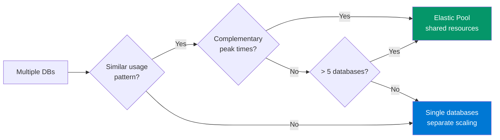

# Elastic Pool Right-Sizing — Azure SQL

> **Atomic skill:** Analyse elastic pool eDTU/vCore utilisation to recommend tier changes.
> **Savings potential:** 30% of Azure SQL spend is over-provisioned pools

## Analysis Pattern

```powershell
# Get pool utilisation metrics for 30 days
$Pools = Get-AzSqlElasticPool -ResourceGroupName $RG -ServerName $Server

foreach ($Pool in $Pools) {
    $Metrics = Get-AzMetric `
        -ResourceId $Pool.ResourceId `
        -MetricName "dtu_consumption_percent" `
        -TimeGrain 01:00:00 `
        -StartTime (Get-Date).AddDays(-30)

    $AvgDTU = ($Metrics.Data | Measure-Object -Property Average -Average).Average
    $MaxDTU = ($Metrics.Data | Measure-Object -Property Maximum -Maximum).Maximum

    $Action = if ($AvgDTU -lt 20 -and $MaxDTU -lt 60) {
        "⬇️ DOWNSIZE — Avg $([math]::Round($AvgDTU,1))%, Peak $([math]::Round($MaxDTU,1))%"
    } elseif ($MaxDTU -gt 90) {
        "⬆️ UPSIZE — Peak $([math]::Round($MaxDTU,1))% hitting ceiling"
    } else {
        "✅ OPTIMAL — Avg $([math]::Round($AvgDTU,1))%, Peak $([math]::Round($MaxDTU,1))%"
    }
    
    [PSCustomObject]@{
        Pool = $Pool.ElasticPoolName
        CurrentDTU = $Pool.Dtu
        AvgUtil = "$([math]::Round($AvgDTU,1))%"
        PeakUtil = "$([math]::Round($MaxDTU,1))%"
        Action = $Action
    }
} | Format-Table -AutoSize
```

## Decision Matrix

| Avg Utilisation | Peak Utilisation | Action |
|:---:|:---:|--------|
| < 20% | < 40% | ⬇️ Downsize 2 tiers |
| < 20% | 40-60% | ⬇️ Downsize 1 tier |
| 20-60% | 60-80% | ✅ Optimal |
| 20-60% | > 80% | ⚠️ Monitor — may need upsize |
| > 60% | > 80% | ⬆️ Upsize 1 tier |
| > 60% | > 90% | 🔴 Upsize NOW — performance risk |

## Pool vs Single Database Decision



## Production Results

**EU Insurance elastic pool optimisation:**
- 12 pools analysed → 4 downsized → **£2,400/month saved**
- 2 pools upsized → eliminated performance tickets
- Net savings: **£1,800/month after upsizing costs**
