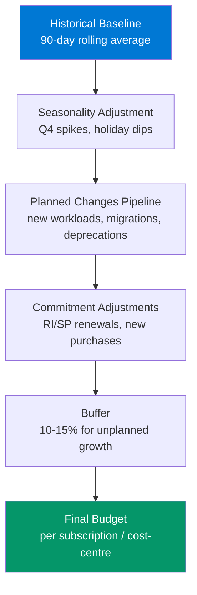

# Budgeting & Forecasting Framework

> Azure cost budgeting methodology — not arbitrary numbers, but data-driven forecasts with escalation paths.

## Budget Setting Methodology

### The Wrong Way
```
Budget = "We spent £X last year, so let's set it to £X"
```
This ignores growth, new projects, seasonality, and RI/SP expirations.

### The Right Way



## Budget Formula

```
Monthly Budget = (Baseline × SeasonalityFactor) + PlannedAdditions - PlannedRemovals + CommitmentDelta + Buffer

Where:
  Baseline          = Average of last 90 days daily spend × 30
  SeasonalityFactor = Last year same month / Last year monthly average
  PlannedAdditions  = New projects starting this month (from Jira/DevOps pipeline)
  PlannedRemovals   = Resources scheduled for decommission
  CommitmentDelta   = RI/SP renewals or new purchases this month
  Buffer            = 10-15% depending on org maturity
```

## Alert Escalation Matrix

| Threshold | Who Gets Alerted | What They Do | Response SLA |
|-----------|-----------------|--------------|-------------|
| **50%** | FinOps team | Monitor trend, no action | Informational |
| **80%** | Engineering lead + FinOps | Review spend, identify drivers | 48 hours |
| **100%** | Department head + FinOps | Mandatory optimisation review | 24 hours |
| **120%** | VP/CFO + all above | Emergency cost review meeting | Same day |

## Forecasting Models

### Model 1: Linear Extrapolation (Simple)
```dax
// DAX: Linear projection based on current run rate
Projected Monthly = 
VAR DaysElapsed = DATEDIFF(STARTOFMONTH(TODAY()), TODAY(), DAY) + 1
VAR DaysInMonth = DAY(EOMONTH(TODAY(), 0))
VAR SpendToDate = [Current Month Spend]
RETURN (SpendToDate / DaysElapsed) * DaysInMonth
```

### Model 2: Weighted Average (Better)
```dax
// DAX: Weight recent spend more heavily
Weighted Forecast = 
VAR Last30Days = [Total Cost Last 30 Days]
VAR SameMonthLastYear = [Total Cost Same Month Last Year]
VAR Weight30 = 0.7   // 70% weight on recent behaviour
VAR WeightLY = 0.3   // 30% weight on seasonality
RETURN (Last30Days * Weight30) + (SameMonthLastYear * WeightLY)
```

### Model 3: Cost Anomaly Detection (Advanced)
```kql
// Detect when current spend deviates >20% from forecast
// Run weekly as part of FinOps review cadence
let Threshold = 0.20;
let CurrentWeekSpend = 125000;  // Replace with actual query
let ForecastWeekSpend = 100000; // Replace with model output
let Deviation = todouble(CurrentWeekSpend - ForecastWeekSpend) / ForecastWeekSpend;
// If Deviation > Threshold → trigger investigation
```

## Budget Review Cadence

| Frequency | Attendees | Agenda | Output |
|-----------|----------|--------|--------|
| **Weekly** | FinOps team | Anomaly review, forecast vs actual | Slack/Teams update |
| **Monthly** | Engineering leads | Budget utilisation, top spenders, optimisation wins | Power BI report |
| **Quarterly** | Department heads + Finance | Budget reforecast, commitment renewals, chargeback reconciliation | Executive summary |
| **Annually** | VP/CFO | Annual budget setting, cloud investment strategy | Board-ready forecast |

## Azure Budget REST API — Programmatic Budget Creation

```json
{
  "properties": {
    "category": "Cost",
    "amount": 50000,
    "timeGrain": "Monthly",
    "timePeriod": {
      "startDate": "2026-01-01",
      "endDate": "2026-12-31"
    },
    "notifications": {
      "Actual_Gt_50_Percent": {
        "enabled": true,
        "operator": "GreaterThan",
        "threshold": 50,
        "contactEmails": ["finops@company.com"],
        "contactRoles": ["Contributor"]
      },
      "Actual_Gt_80_Percent": {
        "enabled": true,
        "operator": "GreaterThan",
        "threshold": 80,
        "contactEmails": ["finops@company.com", "eng-lead@company.com"],
        "contactRoles": ["Contributor", "Owner"]
      },
      "Actual_Gt_100_Percent": {
        "enabled": true,
        "operator": "GreaterThan",
        "threshold": 100,
        "contactEmails": ["finops@company.com", "eng-lead@company.com", "dept-head@company.com"],
        "contactRoles": ["Contributor", "Owner"]
      }
    }
  }
}
```
