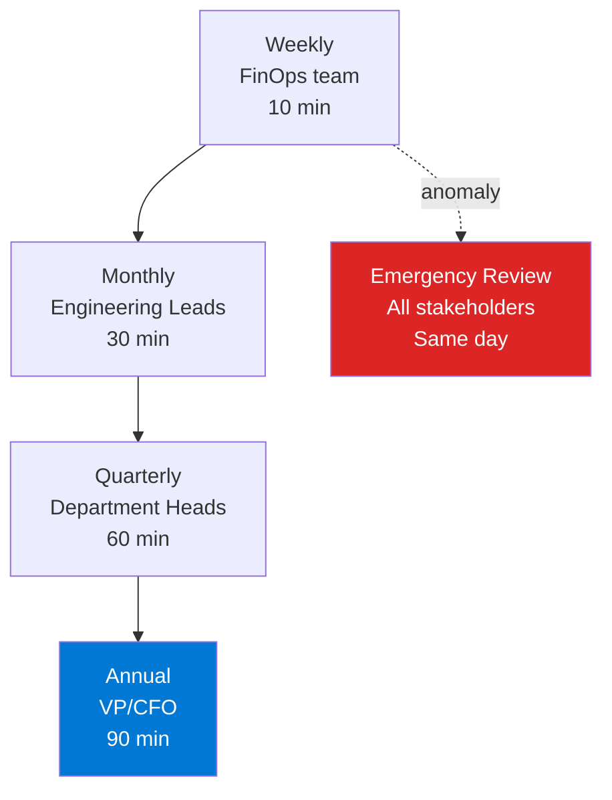

# Budget Escalation Matrix — Framework

> **Atomic skill:** 4-tier alert escalation from FinOps team to CFO.
> **Cross-ref:** [`budget-escalation/`](../../../powershell/cost-management/budget-escalation/) for the PowerShell implementation

## Escalation Matrix

| Threshold | Alert Recipients | Action Required | Response SLA |
|:---:|--------|--------|:---:|
| **50%** | FinOps team | Monitor trend — no action | Informational only |
| **80%** | FinOps + Engineering Lead | Review spend drivers, identify spikes | 48 hours |
| **100%** | + Department Head | Mandatory optimisation review meeting | 24 hours |
| **120%** | + VP / CFO | Emergency cost review — approve additional spend or enforce cuts | Same day |

## Budget Alert REST API Payload

```json
{
  "properties": {
    "category": "Cost",
    "amount": 50000,
    "timeGrain": "Monthly",
    "timePeriod": {
      "startDate": "2026-01-01",
      "endDate": "2026-12-31"
    },
    "notifications": {
      "Actual_Gt_50": {
        "enabled": true,
        "operator": "GreaterThan",
        "threshold": 50,
        "contactEmails": ["finops@company.com"],
        "contactRoles": ["Contributor"]
      },
      "Actual_Gt_80": {
        "enabled": true,
        "operator": "GreaterThan",
        "threshold": 80,
        "contactEmails": ["finops@company.com", "eng-lead@company.com"],
        "contactRoles": ["Contributor", "Owner"]
      },
      "Actual_Gt_100": {
        "enabled": true,
        "operator": "GreaterThan",
        "threshold": 100,
        "contactEmails": ["finops@company.com", "eng-lead@company.com", "dept-head@company.com"],
        "contactRoles": ["Contributor", "Owner"]
      }
    }
  }
}
```

## Review Cadence


