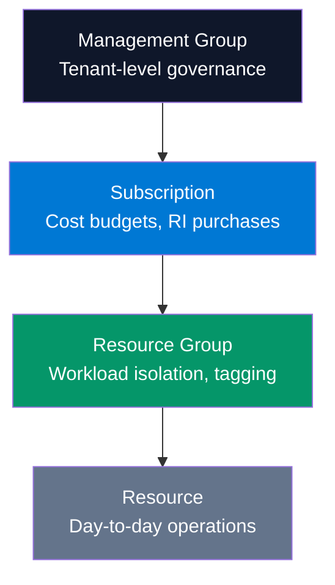

# FinOps RBAC Models — Custom Role Definitions

> Least-privilege access patterns for Azure cost governance. Not everyone needs Owner.

## RBAC Scope Hierarchy



## Custom Role: FinOps Reader

**Purpose:** Finance and leadership who need cost visibility without any infrastructure access.

```json
{
  "properties": {
    "roleName": "FinOps Reader",
    "description": "View cost data, budgets, and recommendations. Cannot modify any resources.",
    "type": "CustomRole",
    "permissions": [
      {
        "actions": [
          "Microsoft.Consumption/*/read",
          "Microsoft.CostManagement/*/read",
          "Microsoft.Billing/*/read",
          "Microsoft.Resources/subscriptions/read",
          "Microsoft.ResourceGraph/*/read",
          "Microsoft.PolicyInsights/*/read",
          "Microsoft.ResourceHealth/*/read",
          "Microsoft.Advisor/*/read"
        ],
        "notActions": [
          "Microsoft.Authorization/*/write",
          "Microsoft.Resources/*/write",
          "Microsoft.Compute/*/write",
          "Microsoft.Storage/*/write"
        ],
        "dataActions": [],
        "notDataActions": []
      }
    ],
    "assignableScopes": [
      "/providers/Microsoft.Management/managementGroups/{mgId}"
    ]
  }
}
```

## Custom Role: Cost Optimization Contributor

**Purpose:** FinOps engineers who apply rightsizing, schedule shutdowns, and execute optimizations.

```json
{
  "properties": {
    "roleName": "Cost Optimization Contributor",
    "description": "Apply cost optimization actions: start/stop VMs, pause SQL, manage budgets. Cannot delete resources or change policies.",
    "type": "CustomRole",
    "permissions": [
      {
        "actions": [
          "Microsoft.Consumption/*/read",
          "Microsoft.CostManagement/*/read",
          "Microsoft.CostManagement/*/action",
          "Microsoft.Resources/subscriptions/read",
          "Microsoft.ResourceGraph/*/read",
          "Microsoft.Compute/virtualMachines/read",
          "Microsoft.Compute/virtualMachines/start/action",
          "Microsoft.Compute/virtualMachines/deallocate/action",
          "Microsoft.Compute/virtualMachines/restart/action",
          "Microsoft.Sql/servers/databases/read",
          "Microsoft.Sql/servers/databases/pause/action",
          "Microsoft.Sql/servers/databases/resume/action",
          "Microsoft.Consumption/budgets/read",
          "Microsoft.Consumption/budgets/write",
          "Microsoft.Consumption/budgets/delete"
        ],
        "notActions": [
          "Microsoft.Compute/virtualMachines/delete",
          "Microsoft.Sql/servers/databases/delete",
          "Microsoft.Authorization/*/write",
          "Microsoft.Resources/subscriptions/delete",
          "Microsoft.PolicyInsights/*/write"
        ],
        "dataActions": [],
        "notDataActions": []
      }
    ],
    "assignableScopes": [
      "/providers/Microsoft.Management/managementGroups/{mgId}"
    ]
  }
}
```

## Custom Role: Budget Owner

**Purpose:** Engineering leads who manage budgets for their team's scope.

```json
{
  "properties": {
    "roleName": "Budget Owner",
    "description": "Create and manage budgets and alerts within assigned scope. Full cost visibility. No resource modification.",
    "type": "CustomRole",
    "permissions": [
      {
        "actions": [
          "Microsoft.Consumption/*/read",
          "Microsoft.Consumption/budgets/write",
          "Microsoft.Consumption/budgets/delete",
          "Microsoft.CostManagement/*/read",
          "Microsoft.Resources/subscriptions/read",
          "Microsoft.ResourceGraph/*/read",
          "Microsoft.Insights/actionGroups/*"
        ],
        "notActions": [
          "Microsoft.Resources/*/write",
          "Microsoft.Compute/*/write"
        ],
        "dataActions": [],
        "notDataActions": []
      }
    ],
    "assignableScopes": [
      "/subscriptions/{subId}"
    ]
  }
}
```

## RBAC Assignment Matrix

| Role | Management Group | Subscription | Resource Group | Who Gets It |
|------|:---:|:---:|:---:|-------------|
| Owner | Platform team only | ❌ | ❌ | Azure platform team |
| Contributor | ❌ | Engineering leads | Workload teams | Senior engineers |
| FinOps Reader | ✅ All | ✅ All | ✅ All | Finance, leadership, FinOps team |
| Cost Optimization Contributor | ❌ | ✅ Assigned subs | ✅ Assigned RGs | FinOps engineers |
| Budget Owner | ❌ | ✅ Owned subs | ✅ Owned RGs | Engineering leads |
| Reader | ❌ | ✅ All | ✅ All | All engineers (default) |

## RBAC Audit KQL

```kql
// Find Owner/Contributor assignments that violate least-privilege
AuthorizationResources
| where type =~ 'microsoft.authorization/roleassignments'
| extend RoleName = tostring(properties.roleDefinitionId)
| extend PrincipalType = tostring(properties.principalType)
| extend Scope = tostring(properties.scope)
| where RoleName has 'b24988ac'   // Contributor GUID
   or RoleName has '8e3af657'     // Owner GUID
| extend ScopeLevel = iff(
    Scope contains '/managementGroups/', 'Management Group',
    iff(Scope contains '/resourceGroups/', 'Resource Group',
    'Subscription')
)
| summarize AssignmentCount = count() by ScopeLevel, RoleName
| order by AssignmentCount desc
```

## Anti-Patterns to Avoid

| ❌ Anti-Pattern | ✅ Correct Pattern |
|----------------|-------------------|
| Owner at Management Group scope | Owner only for platform team, scoped to platform RG |
| Contributor at subscription scope | Cost Optimization Contributor at workload RG scope |
| Same RBAC for all engineers | Tiered: Reader (default) → Contributor (per workload) → Owner (platform only) |
| Service principals with Owner | Use Cost Optimization Contributor for automation accounts |
| Permanent privileged access | Use Privileged Identity Management (PIM) for just-in-time access |
