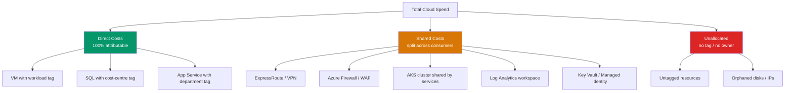
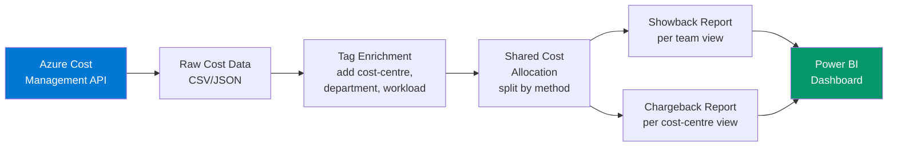

# Showback & Chargeback Framework

> How to allocate Azure cloud costs to the teams that cause them — from visibility (showback) to accountability (chargeback).

## Showback vs Chargeback

| Model | What Happens | Behaviour Change | Maturity |
|-------|-------------|-----------------|----------|
| **Showback** | Teams see their spend but don't pay | Awareness, voluntary optimisation | Crawling |
| **Chargeback** | Teams pay for their spend from their budget | Accountability, mandatory optimisation | Running |
| **Hybrid** | Showback for dev, chargeback for prod | Graduated accountability | Walking |

## Allocation Model — The Hard Part

Not all costs can be directly attributed. The allocation model handles three categories:



## Shared Cost Distribution Methods

### Method 1: Even Split
```
Shared cost per team = Total shared / Number of teams
```
- **Pros:** Simple, easy to explain
- **Cons:** A team with 10 VMs pays same as team with 100
- **Use when:** Just starting, <5 teams

### Method 2: Proportional to Direct Spend
```
Team share = (Team direct spend / Total direct spend) × Total shared
```
- **Pros:** Teams that use more resources pay more shared
- **Cons:** Perceived as penalising growth
- **Use when:** Teams are similar size/workload type

### Method 3: Proportional to Resource Count
```
Team share = (Team resource count / Total resource count) × Total shared
```
- **Pros:** Reflects actual infrastructure footprint
- **Cons:** A small expensive VM counts same as a large cheap one
- **Use when:** Mix of VM types across teams

### Method 4: Consumption-Based (AKS / Pools)
```
Service share = (Service CPU/memory requests × Duration) / Total cluster capacity × Cluster cost
```
- **Pros:** Most accurate for shared platforms
- **Cons:** Requires monitoring instrumentation (Prometheus/Container Insights)
- **Use when:** Shared AKS clusters or elastic pools

## Cost Allocation Pipeline



## Implementation Checklist

- [ ] Define tagging taxonomy (see `tagging-taxonomy/`)
- [ ] Achieve >80% tagging compliance before attempting allocation
- [ ] Identify all shared cost resources
- [ ] Choose shared cost distribution method
- [ ] Build Cost Management API export pipeline
- [ ] Create Power BI dataset with allocation logic
- [ ] Publish showback dashboard (Phase 1)
- [ ] Run showback for 3 months — validate accuracy
- [ ] Get Finance sign-off on chargeback model
- [ ] Switch to chargeback (Phase 2)

## Power BI Allocation DAX Pattern

```dax
// Allocated Cost = Direct + Shared portion
Allocated Cost = 
VAR DirectCost = [Total Cost]  // Already tagged
VAR TeamDirectSpend = CALCULATE(
    [Total Cost],
    FILTER(ALL('Resources'), 'Resources'[Department] = SELECTEDVALUE('Resources'[Department]))
)
VAR AllDirectSpend = CALCULATE([Total Cost], ALL('Resources'[Department]))
VAR SharedCost = CALCULATE(
    [Total Cost],
    'CostExport'[SharedResource] = TRUE()
)
VAR TeamSharedPortion = DIVIDE(TeamDirectSpend, AllDirectSpend, 0) * SharedCost
RETURN DirectCost + TeamSharedPortion
```

## KQL — Identify Shared vs Direct Resources

```kql
// Classify resources as shared or direct based on architecture
Resources
| where type in (
    'microsoft.network/expressroutecircuits',
    'microsoft.network/azurefirewalls',
    'microsoft.operationalinsights/workspaces',
    'microsoft.containerinstance/containergroups',
    'microsoft.kubernetes/connectedclusters',
    'microsoft.keyvault/vaults'
)
| extend IsShared = true()
| union (
    Resources
    | where type !in (
        'microsoft.network/expressroutecircuits',
        'microsoft.network/azurefirewalls',
        'microsoft.operationalinsights/workspaces',
        'microsoft.containerinstance/containergroups',
        'microsoft.kubernetes/connectedclusters',
        'microsoft.keyvault/vaults'
    )
    | extend IsShared = false()
)
| summarize 
    DirectCount = countif(not(IsShared)),
    SharedCount = countif(IsShared)
    by subscriptionId
```
