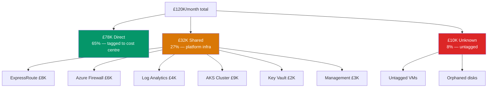

# Shared Cost Allocation — Showback/Chargeback Engine

> **Atomic skill:** How to split shared Azure costs (ExpressRoute, Firewall, AKS) across business units.
> **Cross-ref:** [`cost-by-tag/`](../../../kql/cost-analysis/cost-by-tag/) for the tag-based direct allocation, [`star-schema/`](../../../powerbi/dataset-schema/star-schema/) for the Power BI model

## The Problem



## Allocation Methods

### Method 1: Proportional to Direct Spend

```python
# Allocation logic for Power BI / Python
def allocate_shared(total_shared, team_direct_spends):
    """Split shared costs proportional to each team's direct spend"""
    total_direct = sum(team_direct_spends.values())
    return {
        team: round(shared + (direct / total_direct) * total_shared, 2)
        for team, (shared, direct) in team_direct_spends.items()
    }
```

### Method 2: Per-Resource Count

```python
def allocate_by_count(total_shared, team_resource_counts):
    """Split shared costs by number of resources per team"""
    total = sum(team_resource_counts.values())
    return {
        team: round((count / total) * total_shared, 2)
        for team, count in team_resource_counts.items()
    }
```

### Method 3: AKS Consumption-Based

```python
def allocate_aks(cluster_cost, service_cpu_requests):
    """Allocate AKS cluster cost by CPU/memory consumption"""
    total_cpu = sum(service_cpu_requests.values())
    return {
        service: round((cpu / total_cpu) * cluster_cost, 2)
        for service, cpu in service_cpu_requests.items()
    }
# Example: cluster = £9K/month
# claims-api: 4 CPUs → £3,600
# policy-admin: 3 CPUs → £2,700
# customer-portal: 2 CPUs → £1,800
# data-pipeline: 1 CPU → £900
```

## DAX — Allocated Cost Measure

```dax
Allocated Cost = 
VAR DirectCost = [Total Cost]
VAR TeamDirect = CALCULATE(
    [Total Cost],
    ALL('DimTag'[CostCentre]),
    VALUES('DimTag'[CostCentre])
)
VAR AllDirect = CALCULATE([Total Cost], ALL('DimTag'[CostCentre]))
VAR SharedCost = CALCULATE(
    [Total Cost],
    DimMeter[SharedResource] = TRUE()
)
VAR SharedPortion = DIVIDE(TeamDirect, AllDirect, 0) * SharedCost
RETURN DirectCost + SharedPortion
```

## KQL — Classify Shared vs Direct

```kql
// Tag platform resources as shared for allocation logic
Resources
| where type in (
    'microsoft.network/expressroutecircuits',
    'microsoft.network/azurefirewalls',
    'microsoft.operationalinsights/workspaces',
    'microsoft.keyvault/vaults'
)
| extend IsShared = true(), AllocationMethod = 'proportional'
| union (
    Resources
    | where type !in (
        'microsoft.network/expressroutecircuits',
        'microsoft.network/azurefirewalls',
        'microsoft.operationalinsights/workspaces',
        'microsoft.keyvault/vaults'
    )
    | extend IsShared = false(), AllocationMethod = 'direct'
)
| summarize 
    DirectCount = countif(not(IsShared)),
    SharedCount = countif(IsShared),
    DirectPct = round(countif(not(IsShared)) * 100.0 / count(), 1)
    by subscriptionId
```

## Production Allocation Results

| Client | Direct % | Shared % | Unallocated % | Method |
|--------|:---:|:---:|:---:|--------|
| EU Insurance | 65% | 27% | 8% | Proportional to direct spend |
| UK Water | 72% | 20% | 8% | Per-resource count |
| EU Insurance (after 6 months) | 78% | 18% | 4% | Improved tagging → more direct |
