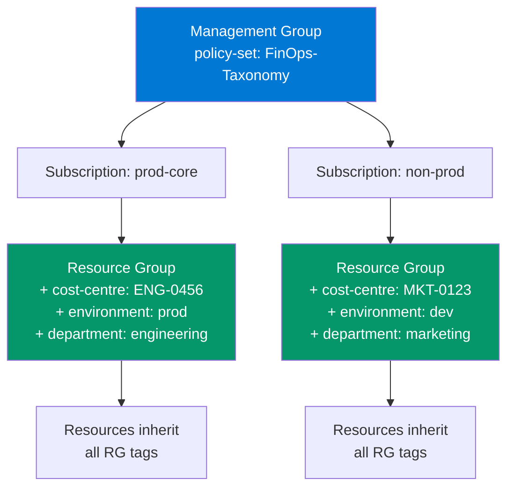

# Enterprise Tagging Taxonomy for Azure FinOps

> The foundation of showback, chargeback, and cost attribution. Without consistent tagging, cost data is unallocatable noise.

## Design Principles

1. **Every resource must have required tags** — enforced via Azure Policy (`deny` effect)
2. **Tags are inherited from Resource Group** — set once at RG level, inherited by children
3. **Tag values are validated** — regex patterns prevent free-text drift
4. **Minimum viable set** — 6 required tags. Every additional tag decreases compliance.

## Required Tags

```json
{
  "taggingTaxonomy": {
    "required": [
      {
        "name": "cost-centre",
        "description": "Financial code for chargeback allocation",
        "pattern": "^[A-Z]{2,4}-[0-9]{3,6}$",
        "examples": ["MKT-0123", "ENG-0456", "OPS-0001"],
        "owner": "Finance",
        "enforcement": "deny"
      },
      {
        "name": "environment",
        "description": "Deployment environment for cost segmentation and policy scoping",
        "allowedValues": ["dev", "test", "staging", "prod", "non-prod", "uat", "dr"],
        "owner": "Engineering",
        "enforcement": "deny"
      },
      {
        "name": "workload",
        "description": "Application or service name for cost-per-workload unit economics",
        "pattern": "^[a-z][a-z0-9-]{2,30}$",
        "examples": ["policy-admin", "claims-api", "customer-portal", "data-platform"],
        "owner": "Product",
        "enforcement": "audit"
      },
      {
        "name": "owner",
        "description": "Team or individual responsible — for cost review cadence invitations",
        "pattern": "^[a-z][a-z0-9-]{2,30}$",
        "examples": ["platform-team", "sai-krishna", "data-engineering"],
        "owner": "Engineering",
        "enforcement": "audit"
      },
      {
        "name": "department",
        "description": "Business unit for executive reporting rollups",
        "allowedValues": ["engineering", "finance", "marketing", "operations", "hr", "legal", "executive"],
        "owner": "Finance",
        "enforcement": "deny"
      },
      {
        "name": "data-classification",
        "description": "Data sensitivity — drives security policy and compliance cost allocation",
        "allowedValues": ["public", "internal", "confidential", "restricted"],
        "owner": "Security",
        "enforcement": "deny"
      }
    ],
    "optional": [
      {
        "name": "managed-by",
        "description": "IaC tool that created this resource",
        "allowedValues": ["terraform", "bicep", "arm", "portal", "manual"]
      },
      {
        "name": "billing-account",
        "description": "EA/MCA account for organisations with multiple enrolments"
      },
      {
        "name": "greenops-region-preference",
        "description": "Carbon-aware region priority for workload placement",
        "allowedValues": ["low-carbon", "balanced", "cost-optimized"]
      },
      {
        "name": "expiry-date",
        "description": "Auto-cleanup date for non-production resources (YYYY-MM-DD)",
        "pattern": "^\\d{4}-\\d{2}-\\d{2}$"
      }
    ]
  }
}
```

## Tag Inheritance Strategy



## Azure Policy — Tag Enforcement

```bicep
// Policy: Inherit cost-centre from Resource Group if missing on resource
// Effect: append (adds tag silently, doesn't block deployment)
// Escalation: after 90 days, switch to deny for new resources

var tagInheritancePolicy = {
  name: 'inherit-cost-centre-from-rg'
  properties: {
    displayName: 'Inherit cost-centre tag from Resource Group'
    mode: 'Indexed'
    policyRule: {
      if: {
        field: 'tags[cost-centre]'
        exists: 'false'
      }
      then: {
        effect: 'modify'
        details: {
          roleDefinitionIds: [
            '/providers/Microsoft.Authorization/roleDefinitions/b24988ac-6180-42a0-ab88-20f7382dd24c' // Contributor
          ]
          operations: [
            {
              operation: 'addOrReplace'
              field: 'tags[cost-centre]'
              value: "[resourceGroup().tags['cost-centre']]"
            }
          ]
        }
      }
    }
  }
}
```

## Compliance Reporting KQL

```kql
// Tag compliance heatmap — which tags are missing where
Resources
| extend 
    HasCostCentre = isnotempty(tags['cost-centre']),
    HasEnvironment = isnotempty(tags['environment']),
    HasWorkload = isnotempty(tags['workload']),
    HasOwner = isnotempty(tags['owner']),
    HasDepartment = isnotempty(tags['department']),
    HasDataClassification = isnotempty(tags['data-classification'])
| summarize 
    Total = count(),
    PctCostCentre = round(countif(HasCostCentre) * 100.0 / count(), 1),
    PctEnvironment = round(countif(HasEnvironment) * 100.0 / count(), 1),
    PctWorkload = round(countif(HasWorkload) * 100.0 / count(), 1),
    PctOwner = round(countif(HasOwner) * 100.0 / count(), 1),
    PctDepartment = round(countif(HasDepartment) * 100.0 / count(), 1),
    PctDataClassification = round(countif(HasDataClassification) * 100.0 / count(), 1)
    by subscriptionId
| order by PctCostCentre asc
```

## Rollout Phases

| Phase | Duration | Policy Effect | Goal |
|-------|----------|--------------|------|
| **1. Audit** | Weeks 1–4 | `audit` only | Baseline compliance measurement |
| **2. Notify** | Weeks 5–8 | `audit` + email reports | Drive awareness, >60% compliance |
| **3. Inherit** | Weeks 9–12 | `modify` (auto-tag from RG) | >85% compliance via inheritance |
| **4. Enforce** | Week 13+ | `deny` for new resources | 100% compliance on new resources |
| **5. Remediate** | Ongoing | `modify` on existing | Clean up legacy non-compliant |
