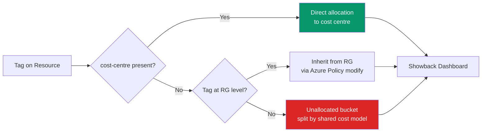

# Enterprise Tag Dictionary — JSON Schema

> **Atomic skill:** The complete tag taxonomy that enables showback/chargeback.
> **Cross-ref:** [`tag-audit/`](../../../kql/governance-compliance/tag-audit/) for compliance measurement, [`tag-enforcement/`](../../../powershell/governance/tag-enforcement/) for automated remediation

## Required Tags (6)

```json
{
  "requiredTags": [
    {
      "name": "cost-centre",
      "displayName": "Cost Centre",
      "description": "Financial code for chargeback allocation",
      "owner": "Finance",
      "validation": {
        "type": "regex",
        "pattern": "^[A-Z]{2,4}-[0-9]{3,6}$",
        "examples": ["MKT-0123", "ENG-0456", "OPS-0001", "FIN-0100"]
      },
      "enforcement": "deny",
      "phase1Effect": "audit",
      "phase3Effect": "deny"
    },
    {
      "name": "environment",
      "displayName": "Environment",
      "description": "Deployment stage for cost segmentation",
      "owner": "Engineering",
      "validation": {
        "type": "enum",
        "allowedValues": ["dev", "test", "staging", "prod", "non-prod", "uat", "dr"],
        "defaultForNew": "dev"
      },
      "enforcement": "deny"
    },
    {
      "name": "workload",
      "displayName": "Workload / Application",
      "description": "Application name for unit economics (cost per workload)",
      "owner": "Product",
      "validation": {
        "type": "regex",
        "pattern": "^[a-z][a-z0-9-]{2,30}$",
        "examples": ["claims-api", "customer-portal", "data-platform", "policy-admin"]
      },
      "enforcement": "audit"
    },
    {
      "name": "owner",
      "displayName": "Owner / Team",
      "description": "Team responsible — invited to cost reviews",
      "owner": "Engineering",
      "validation": {
        "type": "regex",
        "pattern": "^[a-z][a-z0-9-]{2,30}$",
        "examples": ["platform-team", "data-engineering", "sre"]
      },
      "enforcement": "audit"
    },
    {
      "name": "department",
      "displayName": "Department",
      "description": "Business unit for executive rollup reporting",
      "owner": "Finance",
      "validation": {
        "type": "enum",
        "allowedValues": ["engineering", "finance", "marketing", "operations", "hr", "legal", "executive"]
      },
      "enforcement": "deny"
    },
    {
      "name": "data-classification",
      "displayName": "Data Classification",
      "description": "Data sensitivity — drives security policy + compliance cost",
      "owner": "Security",
      "validation": {
        "type": "enum",
        "allowedValues": ["public", "internal", "confidential", "restricted"]
      },
      "enforcement": "deny"
    }
  ],
  "optionalTags": [
    {
      "name": "managed-by",
      "allowedValues": ["terraform", "bicep", "arm", "portal", "manual"],
      "description": "IaC tool that created this resource"
    },
    {
      "name": "expiry-date",
      "pattern": "^\\d{4}-\\d{2}-\\d{2}$",
      "description": "Auto-cleanup date for non-prod resources"
    },
    {
      "name": "greenops-region-preference",
      "allowedValues": ["low-carbon", "balanced", "cost-optimized"],
      "description": "Carbon-aware placement preference"
    },
    {
      "name": "billing-account",
      "description": "EA/MCA account for multi-enrolment orgs"
    }
  ]
}
```

## Tag → Cost Allocation Flow



## Enforcement Phases

| Week | Policy Effect | Expected Compliance | Method |
|------|:---:|:---:|--------|
| 1-2 | `audit` only | 30-40% | Baseline measurement |
| 3-4 | `audit` + email | 50-60% | Drive awareness |
| 5-8 | `modify` (inherit) | 75-85% | Auto-tag from RG |
| 9-12 | `deny` for new | 90%+ | Block non-compliant deploys |
| 13+ | `modify` on existing | 95%+ | Clean up legacy |
