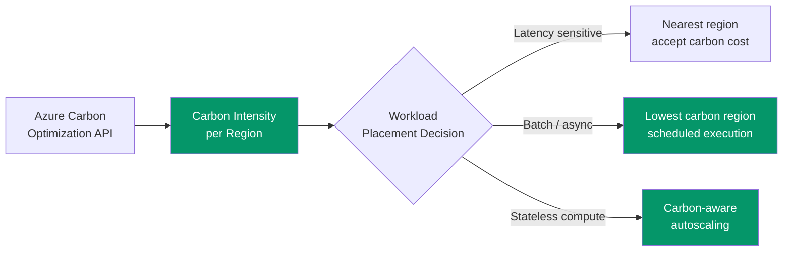

# GreenOps — Carbon-Aware Azure Optimization

> Cost optimization and carbon optimization are aligned — the cheapest resource is often the greenest.

## The GreenOps Opportunity

European regulation (CSRD, EU Taxonomy) now requires sustainability reporting. Azure FinOps engineers who can measure and reduce carbon footprint have a differentiated skill.



## Azure Region Carbon Intensity (Sample Data)

```json
{
  "europeanRegions": [
    { "region": "northeurope", "location": "Ireland", "carbonIntensity": 316, "renewablePct": 42, "costIndex": 1.00, "recommendation": "balanced" },
    { "region": "westeurope", "location": "Netherlands", "carbonIntensity": 339, "renewablePct": 33, "costIndex": 1.00, "recommendation": "balanced" },
    { "region": "uksouth", "location": "UK South", "carbonIntensity": 231, "renewablePct": 48, "costIndex": 1.00, "recommendation": "preferred" },
    { "region": "francecentral", "location": "France", "carbonIntensity": 54, "renewablePct": 92, "costIndex": 1.00, "recommendation": "greenest EU" },
    { "region": "norwayeast", "location": "Norway", "carbonIntensity": 26, "renewablePct": 98, "costIndex": 1.02, "recommendation": "greenest" },
    { "region": "swedencentral", "location": "Sweden", "carbonIntensity": 44, "renewablePct": 96, "costIndex": 1.01, "recommendation": "greenest" },
    { "region": "switzerlandnorth", "location": "Switzerland", "carbonIntensity": 26, "renewablePct": 91, "costIndex": 1.15, "recommendation": "greenest (premium)" },
    { "region": "germanywestcentral", "location": "Germany", "carbonIntensity": 308, "renewablePct": 42, "costIndex": 1.00, "recommendation": "balanced" },
    { "region": "italynorth", "location": "Italy", "carbonIntensity": 211, "renewablePct": 48, "costIndex": 1.00, "recommendation": "balanced" },
    { "region": "polandcentral", "location": "Poland", "carbonIntensity": 663, "renewablePct": 22, "costIndex": 0.92, "recommendation": "cheapest, highest carbon" }
  ],
  "metadata": {
    "carbonUnit": "gCO2eq/kWh",
    "source": "Azure Emissions API + Ember Climate EU electricity data",
    "lastUpdated": "2026-01",
    "note": "Carbon intensity varies by time of day. These are annual averages."
  }
}
```

## Carbon-Aware Region Selection Script

```powershell
#Requires -Module Az.Accounts
<#
.SYNOPSIS
    Recommends Azure regions based on combined cost AND carbon score
.DESCRIPTION
    For batch/non-latency-sensitive workloads, recommends the greenest
    Azure region that still meets compliance and cost requirements.
.EXAMPLE
    .\Select-GreenOpsRegion.ps1 -WorkloadType "batch" -ComplianceRegion "EU"
#>

param(
    [Parameter()]
    [ValidateSet('batch', 'interactive', 'data')]
    [string]$WorkloadType = 'batch',
    
    [Parameter()]
    [ValidateSet('EU', 'UK', 'Global')]
    [string]$ComplianceRegion = 'EU'
)

$Regions = @{
    "northeurope"     = @{ Carbon = 316; Cost = 1.00; Renewable = 42 }
    "westeurope"      = @{ Carbon = 339; Cost = 1.00; Renewable = 33 }
    "uksouth"         = @{ Carbon = 231; Cost = 1.00; Renewable = 48 }
    "francecentral"   = @{ Carbon = 54;  Cost = 1.00; Renewable = 92 }
    "norwayeast"      = @{ Carbon = 26;  Cost = 1.02; Renewable = 98 }
    "swedencentral"   = @{ Carbon = 44;  Cost = 1.01; Renewable = 96 }
    "switzerlandnorth"= @{ Carbon = 26;  Cost = 1.15; Renewable = 91 }
    "germanywestcentral" = @{ Carbon = 308; Cost = 1.00; Renewable = 42 }
    "italynorth"      = @{ Carbon = 211; Cost = 1.00; Renewable = 48 }
    "polandcentral"   = @{ Carbon = 663; Cost = 0.92; Renewable = 22 }
}

# Calculate combined score (lower = better)
# Weighting: 60% carbon, 40% cost for batch workloads
$CarbonWeight = switch ($WorkloadType) {
    'batch' { 0.60 }
    'data'  { 0.50 }
    'interactive' { 0.30 }
}

$Results = foreach ($Region in $Regions.GetEnumerator()) {
    $CarbonNorm = $Region.Value.Carbon / 700  # Normalize to 0-1
    $CostNorm = ($Region.Value.Cost - 0.85) / 0.35  # Normalize to ~0-1
    
    $Score = ($CarbonNorm * $CarbonWeight) + ($CostNorm * (1 - $CarbonWeight))
    
    [PSCustomObject]@{
        Region      = $Region.Key
        Carbon      = $Region.Value.Carbon
        CostIndex   = $Region.Value.Cost
        RenewablePct = $Region.Value.Renewable
        GreenScore  = [math]::Round($Score, 3)
        Recommendation = if ($Score -lt 0.3) { "🟢 Best" } elseif ($Score -lt 0.5) { "🟡 Good" } else { "🔴 Avoid if possible" }
    }
}

$Results | Sort-Object GreenScore | Format-Table -AutoSize
```

## GreenOps Dashboard KQL

```kql
// Estimate carbon impact of VM fleet by region
// Uses Azure Carbon Optimization API data
Resources
| where type =~ 'microsoft.compute/virtualmachines'
| extend VMSize = tostring(properties.hardwareProfile.vmSize)
| extend Region = location
| summarize 
    VMCount = count(),
    Regions = make_set(Region, 10),
    Sizes = make_set(VMSize, 20)
    by subscriptionId
| extend EstimatedCarbonKgPerMonth = VMCount * 50  // Rough estimate: ~50kg CO2/month per average VM
```

## Adding Carbon to Cost Dashboards

| Metric | DAX Measure | Purpose |
|--------|-------------|---------|
| Carbon per £ spent | `DIVIDE([Total Carbon kg], [Total Cost], 0)` | Efficiency metric |
| Carbon by department | `CALCULATE([Total Carbon], VALUES(Resources[Department]))` | Department accountability |
| Carbon trend MoM | Same pattern as cost MoM | Are we getting greener? |
| Greenest workloads | `TOPN(10, VALUES(Resources[Workload]), [Carbon per £ spent], ASC)` | Showcase wins |
