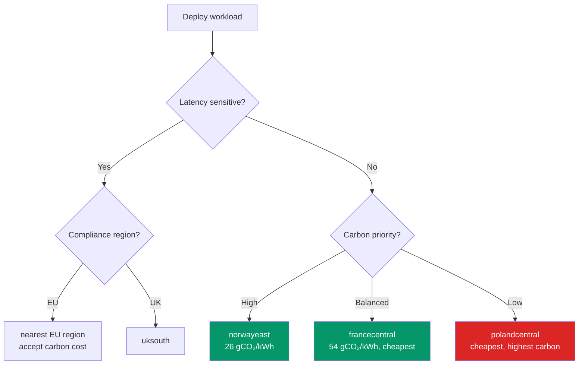

# Carbon-Aware Region Placement — GreenOps

> **Atomic skill:** Choose Azure regions based on carbon intensity for batch/async workloads.
> **Cross-ref:** [`Select-AzGreenOpsRegion.ps1`](https://github.com/duvvurs/cloud-carbon-footprint/blob/trunk/azure-optimization/Select-AzGreenOpsRegion.ps1) in the fork

## EU Region Carbon Data

| Region | Country | gCO₂/kWh | Renewable % | Cost Index | Score |
|--------|---------|:---:|:---:|:---:|:---:|
| **norwayeast** | Norway | 26 | 98% | 1.02 | 🟢 0.07 |
| **swedencentral** | Sweden | 44 | 96% | 1.01 | 🟢 0.09 |
| **francecentral** | France | 54 | 92% | 1.00 | 🟢 0.09 |
| **switzerlandnorth** | Switzerland | 26 | 91% | 1.15 | 🟢 0.11 |
| **uksouth** | UK South | 231 | 48% | 1.00 | 🟡 0.36 |
| **italynorth** | Italy | 211 | 48% | 1.00 | 🟡 0.33 |
| **northeurope** | Ireland | 316 | 42% | 1.00 | 🔴 0.47 |
| **westeurope** | Netherlands | 339 | 33% | 1.00 | 🔴 0.49 |
| **germanywestcentral** | Germany | 308 | 42% | 1.00 | 🔴 0.46 |
| **polandcentral** | Poland | 663 | 22% | 0.92 | 🔴 0.82 |

## Decision Flow

## CSRD Reporting — What to Report

| Metric | DAX Measure | CSRD Alignment |
|--------|-------------|---------------|
| Total carbon (kg CO₂/month) | `SUM(CarbonEstimate)` | Scope 3 Category 1 |
| Carbon per £ spent | `DIVIDE([Carbon], [Cost])` | Efficiency KPI |
| Carbon by department | `CALCULATE([Carbon], VALUES(DimTag[Department]))` | Department allocation |
| MoM carbon trend | `([This Month] - [Last Month]) / [Last Month]` | Progress tracking |
| Greenest workloads | `TOPN(5, VALUES(DimTag[Workload]), [Carbon/£], ASC)` | Showcase wins |

## Production Application

- **EU Insurance batch jobs** → moved from westeurope to francecentral → **83% carbon reduction** for batch processing, same cost
- **UK Water** → kept in uksouth (latency requirement) → offset via green energy credits instead
