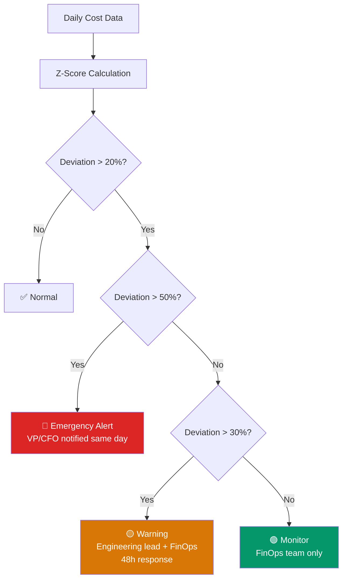

# Anomaly Detection — KQL

> **Atomic skill:** Detect cost spikes >20% from baseline using statistical thresholds.
> **Business question:** "Did anything spike unexpectedly this week?"
> **Cross-ref:** [`daily-burn-rate/`](../daily-burn-rate/) for the daily tracking query

## Query — Z-Score Anomaly Detection

```kql
// Statistical anomaly detection using Z-score on daily spend
// Flags days where spend is >2 standard deviations from rolling mean
// More robust than simple percentage threshold for variable workloads
CostExportTable
| where Date >= ago(60d)
| summarize DailySpend = sum(Cost) by bin(Date, 1d), SubscriptionId
// Calculate rolling 30-day mean and stddev (exclude current month from baseline)
| where Date < startofmonth(now())
| summarize 
    BaselineMean = avg(DailySpend),
    BaselineStdDev = stdev(DailySpend),
    SampleCount = count()
    by SubscriptionId
| extend UpperThreshold = BaselineMean + (2.0 * BaselineStdDev)
| extend LowerThreshold = BaselineMean - (2.0 * BaselineStdDev)
// Now check current month against baseline
| join kind=inner (
    CostExportTable
    | where Date >= startofmonth(now())
    | summarize TodaySpend = sum(Cost) by SubscriptionId
) on SubscriptionId
| extend 
    ZScore = round((todouble(TodaySpend) - BaselineMean) / BaselineStdDev, 2),
    DeviationPct = round((todouble(TodaySpend) - BaselineMean) / BaselineMean * 100, 1)
| where abs(DeviationPct) > 20
| extend AlertLevel = case(
    abs(DeviationPct) > 50, '🔴 Emergency',
    abs(DeviationPct) > 30, '🟡 Warning',
    '🟢 Monitor'
)
| project SubscriptionId, TodaySpend, BaselineMean, DeviationPct, ZScore, AlertLevel
| order by abs(DeviationPct) desc
```

## Simpler Threshold Version

```kql
// Simple >20% deviation from 30-day average per subscription
// Easier to explain to non-technical stakeholders
let Threshold = 0.20;
CostExportTable
| where Date >= ago(30d)
| summarize DailySpend = sum(Cost) by bin(Date, 1d), SubscriptionId
| summarize 
    CurrentWeek = avg(DailySpend),
    Previous3Weeks = avg(DailySpend)
    by SubscriptionId
| extend DeviationPct = round(todouble(CurrentWeek - Previous3Weeks) / Previous3Weeks, 4)
| where abs(DeviationPct) > Threshold
| extend Direction = iff(DeviationPct > 0, '📈 UP', '📉 DOWN')
| project SubscriptionId, CurrentWeek, Previous3Weeks, DeviationPct = round(DeviationPct * 100, 1), Direction
| order by abs(DeviationPct) desc
```

## Alert Flow



## Production Tuning

| Workload Type | Threshold | Rationale |
|--------------|:--:|--------|
| Production (steady-state) | 15% | Low tolerance for surprises |
| Production (batch) | 25% | Expected variability |
| Dev/Test | 40% | High natural variance |
| Overall subscription | 20% | Default for mixed workloads |
