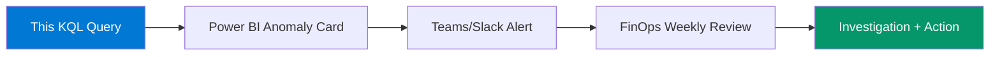

# Daily Burn Rate — KQL

> **Atomic skill:** Track daily Azure spend per subscription to detect anomalies.
> **Business question:** "Is today's spend above or below baseline?"
> **Action it drives:** Weekly FinOps anomaly review
> **Cross-ref:** [`powershell/cost-management/cost-export-pipeline/`](../../powershell/cost-management/cost-export-pipeline/) feeds this data into Power BI.

## Query

```kql
// Daily Azure spend across all subscriptions
// Data source: Azure Cost Management export → Log Analytics workspace
// Replace CostExportTable with your actual table name

CostExportTable
| where Date >= ago(30d)
| summarize DailySpend = sum(Cost) by bin(Date, 1d), SubscriptionId
| order by Date desc
| extend MonthlyProjected = DailySpend * 30
| extend DayOfWeek = dayofweek(Date)
| join kind=leftouter (
    // 30-day rolling average for baseline
    CostExportTable
    | where Date between (ago(60d) .. ago(30d))
    | summarize BaselineSpend = avg(Cost) by SubscriptionId
) on SubscriptionId
| extend DeviationPct = round(todouble(DailySpend - BaselineSpend) / BaselineSpend * 100, 1)
| where abs(DeviationPct) > 20  // Flag >20% deviation from baseline
| project Date, SubscriptionId, DailySpend, MonthlyProjected, BaselineSpend, DeviationPct
| order by abs(DeviationPct) desc
```

## Production Context

**Used for:** European insurance client monthly cost review  
**Frequency:** Weekly, Mondays at 9am  
**Consumer:** FinOps team → engineering leads → department heads  
**Threshold:** >20% deviation triggers investigation, >40% triggers emergency review

## Output Example

| Date | Subscription | DailySpend | MonthlyProjected | Baseline | Deviation |
|------|-------------|-----------|-----------------|----------|-----------|
| 2026-05-07 | sub-prod-core | £4,850 | £145,500 | £3,200 | +51.6% |
| 2026-05-03 | sub-dev-test | £890 | £26,700 | £1,100 | -19.1% |

## Downstream


