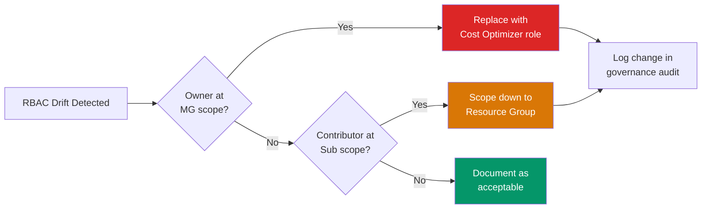

# RBAC Drift Detection — KQL

> **Atomic skill:** Detect role assignments that violate least-privilege governance.
> **Business question:** "Who has Owner/Contributor that shouldn't?"
> **Cross-ref:** [`least-privilege/`](../../../cost-governance/rbac-models/least-privilege/) for the custom role definitions

## Query — High-Privilege Assignment Audit

```kql
// Find Owner/Contributor assignments — flag those at wrong scope
AuthorizationResources
| where type =~ 'microsoft.authorization/roleassignments'
| extend 
    RoleDefId = tostring(properties.roleDefinitionId),
    PrincipalId = tostring(properties.principalId),
    Scope = tostring(properties.scope),
    PrincipalType = tostring(properties.principalType)
| extend RoleName = case(
    RoleDefId has '8e3af657', 'Owner',
    RoleDefId has 'b24988ac', 'Contributor',
    RoleDefId has 'acdd72a7', 'Reader',
    RoleDefId has '18d7d88d', 'User Access Administrator',
    'Other'
)
| where RoleName in ('Owner', 'Contributor', 'User Access Administrator')
| extend ScopeLevel = case(
    Scope contains '/managementGroups/', 'Management Group',
    Scope contains '/resourcegroups/', 'Resource Group',
    'Subscription'
)
| extend IsHuman = PrincipalType == 'User'
| extend Risk = case(
    RoleName == 'Owner' and ScopeLevel == 'Management Group', '🔴 Critical',
    RoleName == 'Owner' and ScopeLevel == 'Subscription', '🟡 High',
    RoleName == 'Contributor' and ScopeLevel == 'Management Group', '🟡 High',
    RoleName == 'Contributor' and ScopeLevel == 'Subscription' and IsHuman, '🟡 Review',
    '🟢 Acceptable'
)
| summarize 
    AssignmentCount = count(),
    CriticalRisk = countif(Risk contains 'Critical'),
    HighRisk = countif(Risk contains 'High')
    by RoleName, ScopeLevel
| order by CriticalRisk desc, HighRisk desc
```

## Service Principal Audit

```kql
// Find service principals / managed identities with excessive permissions
AuthorizationResources
| where type =~ 'microsoft.authorization/roleassignments'
| extend 
    PrincipalType = tostring(properties.principalType),
    RoleDefId = tostring(properties.roleDefinitionId),
    Scope = tostring(properties.scope)
| where PrincipalType in ('ServicePrincipal', 'ManagedIdentity')
| where RoleDefId has '8e3af657' or RoleDefId has 'b24988ac'  // Owner or Contributor
| extend 
    RoleName = iff(RoleDefId has '8e3af657', 'Owner', 'Contributor'),
    ScopeLevel = iff(Scope contains '/managementGroups/', 'MG', iff(Scope contains '/resourcegroups/', 'RG', 'Sub'))
| summarize Count = count() by RoleName, ScopeLevel, PrincipalType
| order by RoleName, ScopeLevel
```

## Remediation Action



## Production Findings

| Engagement | Owner Assignments | Contributor at Sub | Actioned | Risk Removed |
|-----------|:---:|:---:|:---:|:---:|
| EU Insurance | 7 → 2 | 23 → 8 | Replaced with custom roles | 90% |
| UK Water | 3 → 1 | 11 → 4 | Scoped to RG level | 85% |
