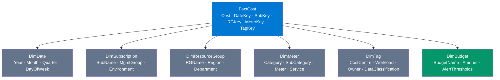
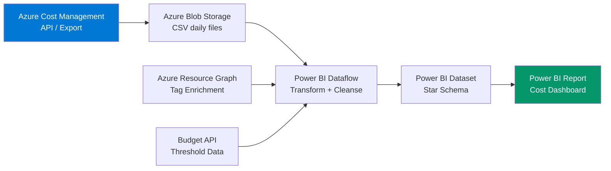

# Power BI — Azure Cost Dataset Schema

> Semantic model design for Azure Cost Management data in Power BI. The schema that makes all the DAX measures work.

## Star Schema Design

## FactCost Table

| Column | Type | Source | Description |
|--------|------|--------|-------------|
| CostID | int | Surrogate key | Unique row identifier |
| DateKey | date | Cost Management API | Billing date |
| SubscriptionKey | int | DimSubscription FK | Subscription reference |
| ResourceGroupKey | int | DimResourceGroup FK | Resource group reference |
| MeterKey | int | DimMeter FK | Service/meter reference |
| TagKey | int | DimTag FK | Tag allocation reference |
| Cost | decimal | Cost Management API | Cost in local currency |
| CostUSD | decimal | Exchange rate | Cost normalised to USD |
| Quantity | decimal | Cost Management API | Usage quantity |
| UnitPrice | decimal | Cost Management API | Per-unit price |
| PricingModel | string | Cost Management API | OnDemand / Reservation / SavingsPlan |

## DimDate Table

| Column | Type | DAX |
|--------|------|-----|
| DateKey | date | `CALENDARAUTO()` |
| Year | int | `YEAR([Date])` |
| Month | int | `MONTH([Date])` |
| MonthName | string | `FORMAT([Date], "MMM")` |
| YearMonth | string | `FORMAT([Date], "YYYY-MM")` |
| Quarter | string | `"Q" & CEILING(MONTH([Date])/3,1)` |
| DayOfWeek | int | `WEEKDAY([Date], 2)` |
| IsCurrentMonth | bool | `EOMONTH([Date],0) = EOMONTH(TODAY(),0)` |
| IsPreviousMonth | bool | `EOMONTH([Date],0) = EOMONTH(EDATE(TODAY(),-1),0)` |

## DimSubscription Table

| Column | Type | Source |
|--------|------|--------|
| SubscriptionKey | int | Surrogate |
| SubscriptionId | string | Azure subscription GUID |
| SubscriptionName | string | Azure subscription display name |
| ManagementGroup | string | Parent management group |
| Environment | string | Tag-derived: prod/non-prod/dev |
| OfferType | string | EA / MCA / CSP — affects pricing |

## DimTag Table

| Column | Type | Source |
|--------|------|--------|
| TagKey | int | Surrogate |
| CostCentre | string | `tags['cost-centre']` |
| Department | string | `tags['department']` |
| Workload | string | `tags['workload']` |
| Owner | string | `tags['owner']` |
| Environment | string | `tags['environment']` |
| DataClassification | string | `tags['data-classification']` |
| IsAllocated | bool | `NOT(ISBLANK(CostCentre))` |

## Data Ingestion Flow

## Relationship Model

| From | To | Cardinality | Cross-filter |
|------|----|-------------|-------------|
| FactCost → DimDate | DateKey → DateKey | Many-to-one | Single |
| FactCost → DimSubscription | SubscriptionKey → SubscriptionKey | Many-to-one | Single |
| FactCost → DimResourceGroup | ResourceGroupKey → ResourceGroupKey | Many-to-one | Single |
| FactCost → DimMeter | MeterKey → MeterKey | Many-to-one | Single |
| FactCost → DimTag | TagKey → TagKey | Many-to-one | Single |
| DimBudget → DimSubscription | SubscriptionKey → SubscriptionKey | Many-to-one | Single |
