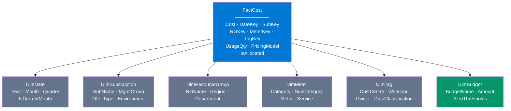

# Star Schema — Power BI Dataset Design

> **Atomic skill:** The data model that powers all FinOps dashboards.
> **Cross-ref:** [`cost-export-pipeline/`](../../../powershell/cost-management/cost-export-pipeline/) feeds this schema, [`mom-change/`](../../dax-measures/mom-change/) uses it

## Schema Diagram



## Table Definitions

### FactCost (Fact Table)

| Column | Type | Grain |
|--------|------|-------|
| CostID | int | Surrogate key |
| DateKey | date | Daily granularity |
| SubscriptionKey | int | FK → DimSubscription |
| ResourceGroupKey | int | FK → DimResourceGroup |
| MeterKey | int | FK → DimMeter |
| TagKey | int | FK → DimTag |
| Cost | decimal | Spend in local currency |
| CostUSD | decimal | Normalised to USD |
| UsageQuantity | decimal | Usage amount |
| PricingModel | string | OnDemand / Reservation / SavingsPlan |
| IsAllocated | boolean | Has cost-centre tag? |

### DimTag (Critical for Showback)

| Column | Type | Source |
|--------|------|--------|
| TagKey | int | Surrogate |
| CostCentre | string | `tags['cost-centre']` |
| Department | string | `tags['department']` |
| Workload | string | `tags['workload']` |
| Owner | string | `tags['owner']` |
| Environment | string | `tags['environment']` |
| IsAllocated | bool | `NOT(ISBLANK(CostCentre))` |

## Relationships

| From | To | Cardinality | Filter |
|------|----|-------------|--------|
| FactCost → DimDate | DateKey→DateKey | Many:1 | Single |
| FactCost → DimSubscription | SubKey→SubKey | Many:1 | Single |
| FactCost → DimResourceGroup | RGKey→RGKey | Many:1 | Single |
| FactCost → DimMeter | MeterKey→MeterKey | Many:1 | Single |
| FactCost → DimTag | TagKey→TagKey | Many:1 | Single |
| DimBudget → DimSubscription | SubKey→SubKey | Many:1 | Single |

## Dataflow Architecture

```mermaid
graph LR
    A[Cost Management<br>API Export] --> B[Azure Blob<br>CSV daily]
    B --> C[Power BI<br>Dataflow Transform]
    F[Resource Graph<br>Tag Data] --> C
    G[Budget API<br>Thresholds] --> C
    C --> D[Power BI<br>Dataset (this schema)]
    D --> E[Cost Dashboard]
    
    style A fill:#0078D4,color:#fff
    style E fill:#059669,color:#fff
```
