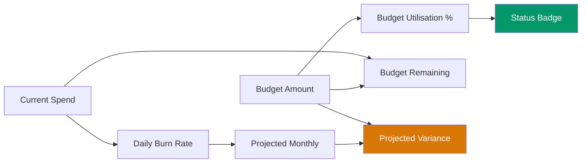

# Budget Variance — DAX

> **Atomic skill:** Track actual spend vs budget with variance and projected overrun.
> **Cross-ref:** [`escalation-matrix/`](../../../cost-governance/budgeting-forecasting/escalation-matrix/) for the alert tiers

## Measures

```dax
// Budget Amount (from DimBudget)
Budget Amount = SUM('DimBudget'[Amount])

// Budget Consumed %
Budget Utilisation % = DIVIDE([Current Month Spend], [Budget Amount], 0)

// Budget Remaining
Budget Remaining = [Budget Amount] - [Current Month Spend]

// Days Elapsed in Month
Days Elapsed = 
VAR Today = TODAY()
VAR MonthStart = DATE(YEAR(Today), MONTH(Today), 1)
RETURN DATEDIFF(MonthStart, Today, DAY) + 1

// Days in Month
Days in Month = DAY(EOMONTH(TODAY(), 0))

// Daily Burn Rate
Daily Burn Rate = DIVIDE([Current Month Spend], [Days Elapsed], 0)

// Projected Monthly Spend
Projected Monthly = [Daily Burn Rate] * [Days in Month]

// Projected Variance
Projected Variance = [Projected Monthly] - [Budget Amount]

// Projected Variance %
Projected Variance % = DIVIDE([Projected Variance], [Budget Amount], 0)

// Budget Health Status
Budget Health = 
VAR Pct = [Budget Utilisation %]
RETURN IF(Pct >= 1.0, "🔴 Over Budget",
     IF(Pct >= 0.80, "🟡 Warning",
     IF(Pct >= 0.50, "🟢 On Track",
     "⚪ Early Month")))
```

## Visual Layout



## Conditional Formatting Rules

| Utilisation | Background | Font |
|:---:|--------|------|
| 0-50% | 🟢 Green | White |
| 50-80% | 🟡 Amber | Black |
| 80-100% | 🟠 Orange | White |
| >100% | 🔴 Red | White |
