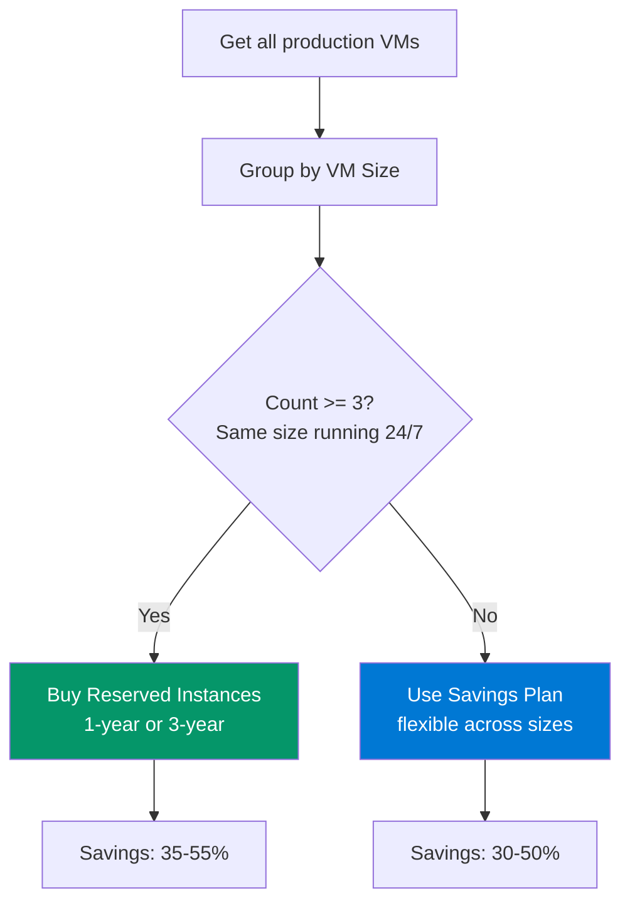

# RI Coverage Analysis — PowerShell

> **Atomic skill:** Analyze On-Demand VM usage for Reserved Instance / Savings Plan opportunities.
> **Source:** [`finops-toolkit/src/scripts/finops-governance/Get-FinOpsRIOpportunity.ps1`](https://github.com/duvvurs/finops-toolkit/blob/dev/src/scripts/finops-governance/Get-FinOpsRIOpportunity.ps1)
> **Cross-ref:** [`ri-vs-sp-decision/`](../../../reserved-instances/ri-vs-sp-decision/) for the decision framework

## The Analysis



## Usage

```powershell
# Analyze production VMs for RI opportunities
.\Get-FinOpsRIOpportunity.ps1 -SubscriptionId "sub1" -Environment "prod"

# 3-year term (higher savings, longer commitment)
.\Get-FinOpsRIOpportunity.ps1 -SubscriptionId "sub1" -Term "3-year"
```

## Output Example

| VMSize | Count | CurrentMonthly | AfterRI_Monthly | Savings | Pct | Recommendation |
|--------|:---:|:---:|:---:|:---:|:---:|--------|
| D4s_v5 | 8 | £1,120 | £672 | £448 | 40% | BUY: Reserve 6 RIs |
| E4s_v5 | 5 | £1,050 | £630 | £420 | 40% | BUY: Reserve 4 RIs |
| D2s_v5 | 12 | £840 | £504 | £336 | 40% | BUY: Reserve 10 RIs |
| F2s_v2 | 2 | £176 | £106 | £70 | 40% | SP: Savings Plan for flexibility |

## Coverage Targets

| Environment | Target Coverage | Method |
|-------------|:---:|--------|
| **Production** | 70-85% | RIs for stable, SP for variable |
| **Staging/UAT** | 30-50% | SP only |
| **Dev/Test** | 0% | Schedule shutdown instead |

## Breakeven Analysis

| Term | Upfront Savings | Monthly Savings | Breakeven |
|------|:---:|:---:|:---:|
| 1-year RI | ~40% | ~33% | 5-7 months |
| 3-year RI | ~55% | ~50% | 4-5 months |
| 1-year SP | ~35% | ~30% | 6-8 months |

## Production Evidence

**EU Insurance RI purchase history:**
- Month 1: Bought 12× D4s_v5 1-year RIs → £5,376/month savings
- Month 3: Bought 6× E4s_v5 1-year RIs → £2,520/month savings
- Month 6: Bought SP for variable workloads → £1,800/month savings
- **Total: £9,696/month (£116K/year) from commitment optimization alone**
