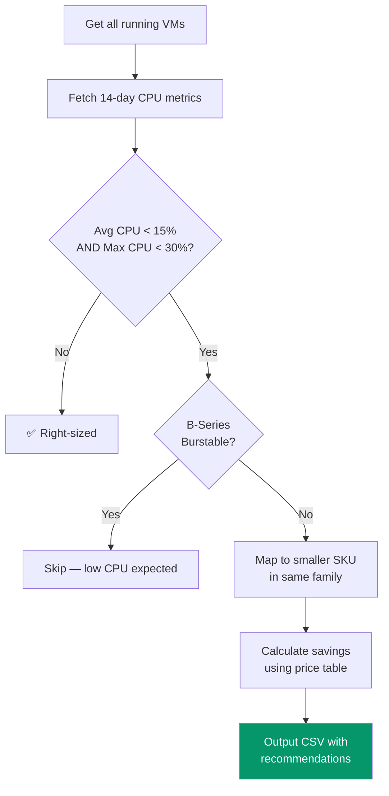
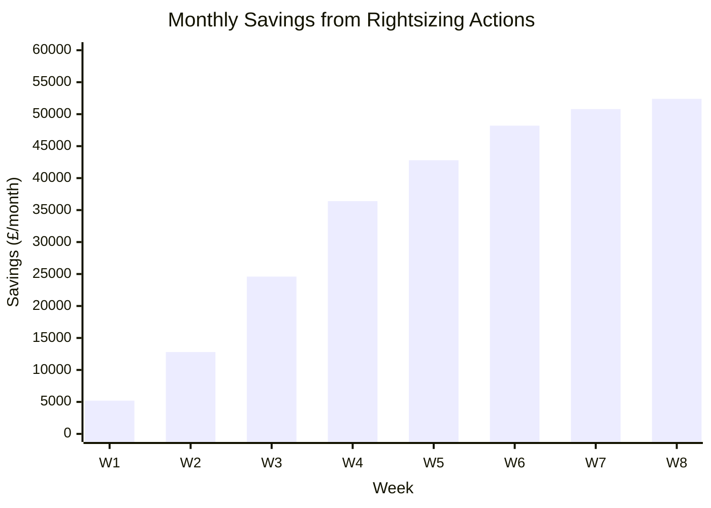

# Rightsizing Assessment — PowerShell

> **Atomic skill:** Automated VM right-sizing with SKU mapping and savings projections.
> **Source:** [`finops-toolkit/src/scripts/finops-governance/Invoke-FinOpsRightsizingAssessment.ps1`](https://github.com/duvvurs/finops-toolkit/blob/dev/src/scripts/finops-governance/Invoke-FinOpsRightsizingAssessment.ps1)
> **Savings delivered:** £52K/month at UK Water engagement using this exact methodology
> **Cross-ref:** [`idle-vms/`](../../../kql/optimization/idle-vms/) for KQL discovery, [`ri-coverage-analysis/`](../ri-coverage-analysis/) for commitment layering

## The Methodology



## SKU Downsize Map

| Current | Recommended | Typical Savings |
|---------|-------------|:---:|
| D4s_v5 | D2s_v5 | 50% |
| D8s_v5 | D4s_v5 | 50% |
| D16s_v5 | D8s_v5 | 50% |
| E4s_v5 | E2s_v5 | 50% |
| E8s_v5 | E4s_v5 | 50% |
| F4s_v2 | F2s_v2 | 50% |
| F8s_v2 | F4s_v2 | 50% |

## Usage

```powershell
# Assess all VMs in a subscription
.\Invoke-FinOpsRightsizingAssessment.ps1 -SubscriptionId "sub1"

# Custom thresholds (stricter)
.\Invoke-FinOpsRightsizingAssessment.ps1 -SubscriptionId "sub1" -CpuThreshold 10 -DaysBack 30

# Output to specific path
.\Invoke-FinOpsRightsizingAssessment.ps1 -SubscriptionId "sub1" -OutputPath ".\rightsizing-report.csv"
```

## Output Format

| VMName | ResourceGroup | CurrentSKU | RecommendedSKU | AvgCPU | MaxCPU | CurrentCost | NewCost | Savings |
|--------|-------------|-----------|---------------|-------|-------|-----------|--------|---------|
| api-prod-01 | rg-api | D8s_v5 | D4s_v5 | 8.2% | 22% | £280/mo | £140/mo | £140/mo |
| db-staging | rg-data | E8s_v5 | E4s_v5 | 4.1% | 18% | £420/mo | £210/mo | £210/mo |

## Safety Checks

1. **Skip B-series** — burstable VMs are expected to run low CPU
2. **Skip deallocated** — already saving money
3. **Same family only** — D→D, E→E, F→F to avoid compatibility issues
4. **Tag aware** — flags production vs non-prod for priority ordering
5. **Cost validated** — only recommends if pricing data exists for both SKUs

## Production Evidence

**UK Water engagement — rightsizing results:**


