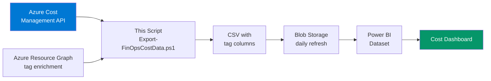

# Cost Export Pipeline — PowerShell

> **Atomic skill:** Full pipeline from Azure Cost Management API → CSV → Power BI.
> **Source:** [`finops-toolkit/src/scripts/finops-governance/Export-FinOpsCostData.ps1`](https://github.com/duvvurs/finops-toolkit/blob/dev/src/scripts/finops-governance/Export-FinOpsCostData.ps1)
> **Cross-ref:** [`star-schema/`](../../../powerbi/dataset-schema/star-schema/) for the Power BI data model, [`daily-burn-rate/`](../../../kql/cost-analysis/daily-burn-rate/) for queries using this data

## Pipeline Architecture



## Usage

```powershell
# Basic export — 30 days, daily granularity
.\Export-FinOpsCostData.ps1 -SubscriptionIds @("sub1","sub2") -DaysBack 30

# Full export with tag enrichment for Power BI
.\Export-FinOpsCostData.ps1 -SubscriptionIds @("sub1") -DaysBack 90 -IncludeTags -Granularity Monthly

# Scheduled runbook (Azure Automation)
.\Export-FinOpsCostData.ps1 -SubscriptionIds $env:SUB_IDS -DaysBack 1 -OutputPath "./daily-$(Get-Date -Format 'yyyyMMdd').csv"
```

## Output Columns (Power BI Ready)

| Column | Type | Source | Power BI Table |
|--------|------|--------|---------------|
| Date | date | Cost API | FactCost |
| SubscriptionId | string | Cost API | DimSubscription |
| ResourceGroup | string | Cost API | DimResourceGroup |
| ResourceType | string | Cost API | DimResourceGroup |
| MeterCategory | string | Cost API | DimMeter |
| MeterSubCategory | string | Cost API | DimMeter |
| PricingModel | string | Cost API | FactCost |
| Cost | decimal | Cost API | FactCost |
| UsageQuantity | decimal | Cost API | FactCost |
| Currency | string | Cost API | FactCost |
| **CostCentre** | string | Tag enrichment | **DimTag** |
| **Environment** | string | Tag enrichment | **DimTag** |
| **Workload** | string | Tag enrichment | **DimTag** |
| **Department** | string | Tag enrichment | **DimTag** |
| **Owner** | string | Tag enrichment | **DimTag** |
| **IsAllocated** | boolean | Derived | FactCost |

## Tag Parsing Logic

The script parses Azure's flat tag string into individual columns:

```powershell
# Azure returns tags as: "cost-centre:ENG-0456`nenvironment:prod`nworkload:claims-api"
# This script splits and extracts into individual columns for Power BI dimensions

$TagPairs = $TagString -split '`n'
foreach ($Pair in $TagPairs) {
    if ($Pair -match 'cost-centre:(.+)') { $CostCentre = $Matches[1].Trim() }
    if ($Pair -match 'environment:(.+)') { $Environment = $Matches[1].Trim() }
    # ... etc
}
```

## Scheduling

```yaml
# Azure Automation Runbook Schedule
trigger: daily
time: '06:00 UTC'
parameters:
  SubscriptionIds: '${SUBSCRIPTION_IDS}'
  DaysBack: 1
  Granularity: Daily
  IncludeTags: true
  OutputPath: '/exports/daily-cost-$(date +%Y%m%d).csv'
```

## Production Metrics

- **EU Insurance:** 90-day export across 4 subscriptions = ~12,000 rows/day
- **UK Water:** 30-day export across 2 subscriptions = ~3,400 rows/day
- **Pipeline latency:** API → CSV in ~45 seconds, CSV → Power BI refresh in ~2 minutes
