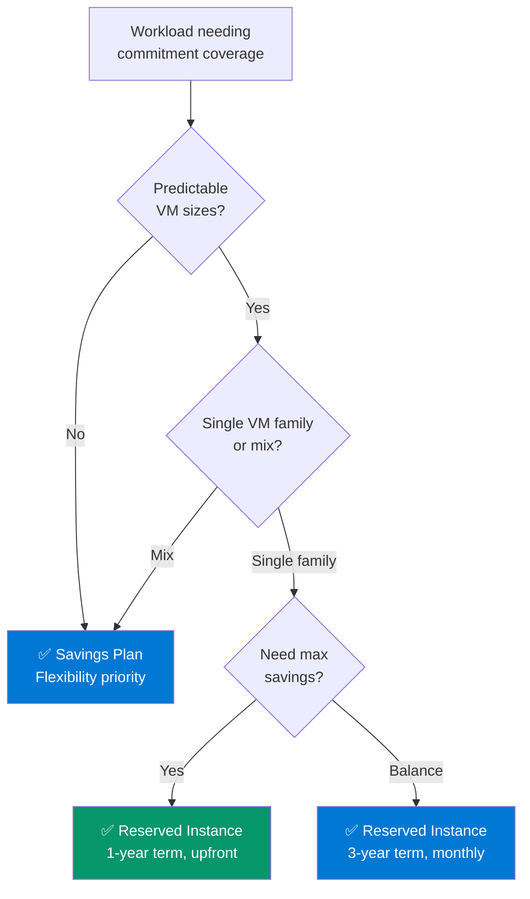

# Reserved Instances & Savings Plans Strategy

> Commitment optimization is the single highest-impact FinOps action. 30-60% savings with zero architecture changes.

## RI vs Savings Plan Decision Framework



## Coverage Analysis — What to Buy Next

### Step 1: Identify On-Demand Spend

```kql
// Find VMs running On-Demand that are candidates for RI/SP coverage
// Run monthly as part of FinOps review
Resources
| where type =~ 'microsoft.compute/virtualmachines'
| extend VMSize = tostring(properties.hardwareProfile.vmSize)
| where VMSize !contains 'Basic'  // Basic tier not eligible for RIs
| summarize 
    OnDemandVMs = count(),
    Sizes = make_set(VMSize, 30)
    by subscriptionId, tostring(tags['environment'])
| where tostring(tags['environment']) in ('prod', 'production')  // Start with production
| order by OnDemandVMs desc
```

### Step 2: Match to RI Offerings

```powershell
#Requires -Module Az.Compute, Az.Accounts
<#
.SYNOPSIS
    Analyzes current VM usage and recommends RI purchases
.DESCRIPTION
    Production pattern for RI coverage gap analysis.
    Identifies which VM sizes to buy RIs for based on:
    1. Consistent usage (running >80% of hours, 30-day window)
    2. Production workloads only (non-prod → schedule shutdown instead)
    3. Break-even analysis (when does RI pay off?)
#>

param(
    [Parameter()]
    [string[]]$SubscriptionIds,
    
    [Parameter()]
    [int]$MinUsageHours = 576,  # 80% of 720 hours/month
    
    [Parameter()]
    [ValidateSet('1-year', '3-year')]
    [string]$Term = '1-year'
)

# Pricing reference (approximate, use Azure Retail API for actual)
$RIDiscounts = @{
    '1-year'  = @{ Upfront = 0.40; Monthly = 0.35 }  # ~35-40% savings
    '3-year'  = @{ Upfront = 0.55; Monthly = 0.50 }   # ~50-55% savings
}

foreach ($SubId in $SubscriptionIds) {
    Write-Host "`n--- Subscription: $SubId ---" -ForegroundColor Cyan
    
    $VMs = Get-AzVM -DefaultProfile (Get-AzContext)
    $ProdVMs = $VMs | Where-Object { 
        $_.Tags['environment'] -in @('prod', 'production') 
    }
    
    $ProdVMs | Group-Object { $_.HardwareProfile.VmSize } | ForEach-Object {
        $Size = $_.Name
        $Count = $_.Count
        $SavingsPct = if ($Term -eq '1-year') { 0.37 } else { 0.52 }
        
        [PSCustomObject]@{
            VMSize        = $Size
            Count         = $Count
            Term          = $Term
            SavingsPct    = "$([math]::Round($SavingsPct * 100))%"
            Recommendation = if ($Count -ge 2) { "BUY: Group into $([math]::Floor($Count * 0.8)) RIs" } else { "MONITOR: Single VM, consider Savings Plan instead" }
        }
    } | Format-Table -AutoSize
}
```

### Step 3: RI vs SP Comparison Table

| Factor | Reserved Instance | Savings Plan |
|--------|:--:|:--:|
| **Discount (1yr)** | 35-40% | 30-35% |
| **Discount (3yr)** | 50-55% | 45-50% |
| **Scope** | Specific VM size + region | Compute across all sizes/regions |
| **Flexibility** | Size flexibility within family | Any VM size, any region |
| **Exchange** | Can exchange for different RI | Can cancel (6hr window) |
| **Best for** | Predictable prod workloads | Mixed/evolving workloads |
| **EA advantage** | Can use Azure Prepayment | Can use Azure Prepayment |
| **MCA advantage** | Self-serve purchase | Self-serve purchase |

## Coverage Calculator

```dax
// DAX: RI Coverage Percentage
RI Coverage % = 
VAR CoveredVMs = CALCULATE(
    COUNTROWS('Resources'),
    'Resources'[PricingModel] = "Reservation",
    'Resources'[Type] = "Microsoft.Compute/virtualMachines"
)
VAR AllProdVMs = CALCULATE(
    COUNTROWS('Resources'),
    'Resources'[Environment] = "prod",
    'Resources'[Type] = "Microsoft.Compute/virtualMachines"
)
RETURN DIVIDE(CoveredVMs, AllProdVMs, 0)
```

## Target Coverage Benchmarks

| Environment | RI/SP Target | Method |
|-------------|:--:|--------|
| **Production** | 70-85% | RIs for stable workloads, SP for variable |
| **Staging/UAT** | 30-50% | SP only (workloads change frequently) |
| **Dev/Test** | 0% | Use schedule shutdown, not commitments |

## RI Renewal Tracking

```kql
// Find RIs expiring in next 90 days — proactive renewal
Resources
| where type =~ 'microsoft.compute/reservations'
| extend 
    ExpiryDate = todatetime(properties.expiryDate),
    Term = tostring(properties.term),
    AppliedScope = tostring(properties.appliedScopeType),
    SKU = tostring(properties.sku.name)
| where ExpiryDate between (now() .. now() + 90d)
| project name, SKU, Term, ExpiryDate, AppliedScope, subscriptionId
| order by ExpiryDate asc
```

## Break-Even Analysis Template

| VM Size | On-Demand Monthly | RI 1yr Monthly | Monthly Savings | Months to Break Even (Upfront) |
|---------|:--:|:--:|:--:|:--:|
| D2s_v5 | £70 | £45 | £25 | 7 |
| D4s_v5 | £140 | £90 | £50 | 7 |
| E4s_v5 | £165 | £105 | £60 | 7 |
| F4s_v2 | £120 | £75 | £45 | 7 |

> Typical break-even for 1-year RI with upfront payment: **5-7 months**. After that, pure savings.
