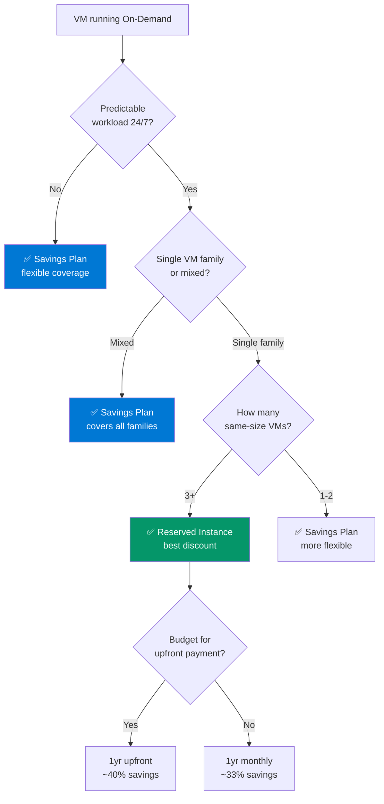

# RI vs Savings Plan Decision — Framework

> **Atomic skill:** When to buy Reserved Instances vs Savings Plans — the decision matrix.
> **Cross-ref:** [`ri-coverage-analysis/`](../../../powershell/automation/ri-coverage-analysis/) for the automated analysis script

## Decision Tree



## Comparison Table

| Factor | RI (1-year) | RI (3-year) | SP (1-year) | SP (3-year) |
|--------|:---:|:---:|:---:|:---:|
| **Discount** | 35-40% | 50-55% | 30-35% | 45-50% |
| **Scope** | Specific VM size + region | Same | Any VM, any region | Same |
| **Flexibility** | Size-flex within family | Same | Fully flexible | Same |
| **Exchange** | Can exchange RI | Same | Cancel within 6hr | Same |
| **Upfront option** | Yes (best discount) | Yes | Yes | Yes |
| **Monthly option** | Yes | Yes | Yes | Yes |
| **Best for** | Stable prod VMs | Long-term prod | Mixed workloads | Long-term mixed |
| **EA/MCA** | Both | Both | Both | Both |

## Coverage Targets by Environment

```python
# Coverage calculator
def recommend_coverage(env, vm_count, consistent_24x7):
    if env == 'prod' and consistent_24x7:
        ri_pct = min(0.80, vm_count * 0.1)  # Up to 80% RI
        sp_pct = max(0, 0.85 - ri_pct)      # Fill to 85% with SP
        return f"RI: {ri_pct:.0%}, SP: {sp_pct:.0%}, On-Demand: {1-ri_pct-sp_pct:.0%}"
    elif env in ('staging', 'uat'):
        return f"RI: 0%, SP: 40%, On-Demand: 60%"
    else:  # dev/test
        return f"RI: 0%, SP: 0%, On-Demand: 100% (use schedule shutdown)"
```

## Breakeven Calculator

| VM Size | On-Demand/mo | RI 1yr/mo | Savings/mo | Months to Breakeven |
|--------|:---:|:---:|:---:|:---:|
| D2s_v5 | £70 | £43 | £27 | 5 |
| D4s_v5 | £140 | £86 | £54 | 5 |
| D8s_v5 | £280 | £172 | £108 | 5 |
| E4s_v5 | £210 | £130 | £80 | 5 |
| E8s_v5 | £420 | £260 | £160 | 5 |

**Typical breakeven: 5-7 months for 1-year RI.** After that, pure savings.
